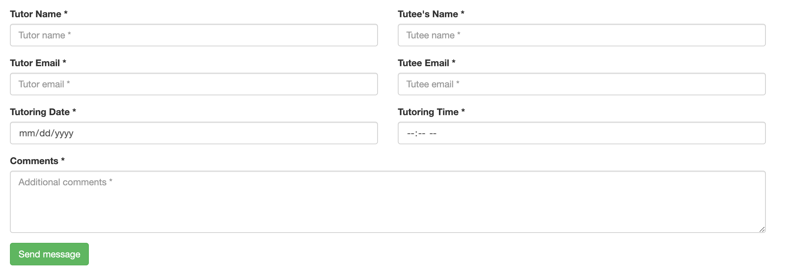
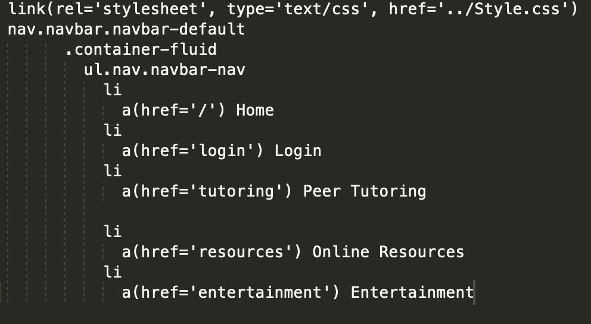
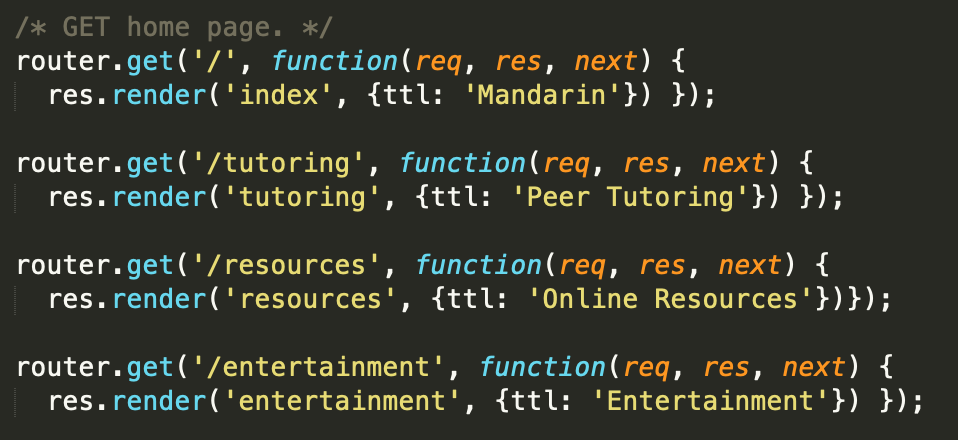

# 20PercentSecondSemester
# ChineseWebsite
Note: files that are not explained are libraries for the AuthO Login or part of the inital setup. 
## app.js
app.js is the file that is used for the AuthO Login page. It's main functionality is log users in through AuthO and return an error if any information is incorrect. 
## public 
### images
images folder holds all of the images that appear on my wbsite. Most of them are .jpg files. 
### pages
pages folder holds all of the html files for each tab of my website. (Later converted to pug) 
Includes: entertainment.html, resources.html, login.html, and tutoring.html
### index.html
indext.html is the homepage and it is not within the pages folder. It includes the bootstrap for the hearder, tool bar, and the formating of the images on the home page. 
## views 
The views folder holds all of the html files after converted to pug. **tutoring.pug** includes the form that is used to send the emails. There are several form-groups for the inputs. The image below is the tutoring tab. 

On top of the main pages, it also has **navbar.pug** and **menu.pug** 
### navBar.pug
Becuase every page has a navbar, I created a seperate file with the code for navbar and just included navbar.pug for every page. This makes the code a lot neater. 

### menu.pug
The title of the pages are also repetitive so the menu.pug acts the same as navBar.pug. The only difference is that because each page is titled differently, in index.js each page render's a differnt title.
## routes
### auth.js
auth.js is used to program the Auth0 Login. It performs the signing in and the log out. It includes the redirecting code after a user has logged in.  
### index.js
index.js holds the post and get functions. 
#### GET
There is a router.get for every page (index, tutoring, login, resources, and entertainment) that renders the page and the title.

#### POST
Post is used for nodemailer. **var mailOptions** takes in the sender email and reads in from the the slots on the form for the other information (names, date, time).

**transportor.sentMail** sends the email and gives and error is the email was not sent. It also redirects the user back to the tutoring page. 

## Notes
To pick up on this project, soem things to keep in mind are:
* The Auth0 Login does not link to the Peer Tutoring page currently.
* In order to run the nodemailer, you would have to install nodemailer in terminal (**npm install nodemailer --save**)
